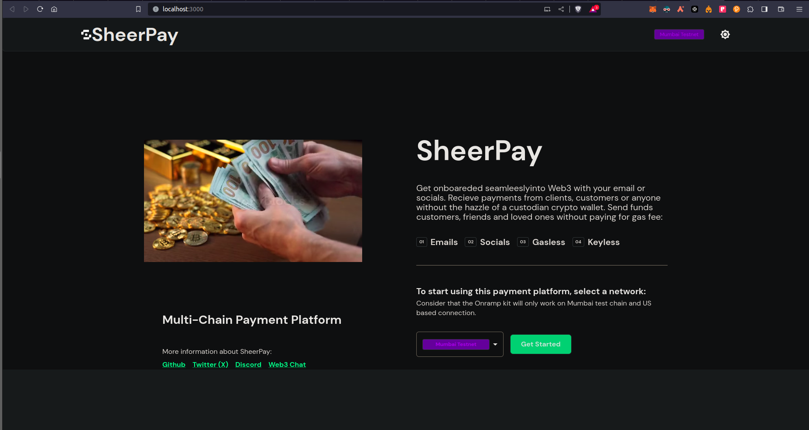

# SheerPay app

## Introduction

A payment solution that uses Account Abstraction and a secured method to transfer payment using email addresses or social logins  (something that users are already familiar with). Leveraging AA's capabilities to facilitate cost-effective and instantaneous settlements.



## Problem Statement

Africa's crypto adoption is not great due to the cumbersomeness of using wallets.  If you use something that is already familiar to the users, it will get more adoption.

The everyday person in Africa does not know or is afraid of using web3.  Downloading wallets, private keys etc.have not really encourgaed more users from Africa to accept web3. The cumbersome onbaording scenerio made web have very little chance to penetrate the broaders of African market. In short, it is confined to a small number of Africans.

What if we can create a platform that the users only signup with what they are already familiar with (emails, socials login, phone number etc.)  The platform create an addresss under the hood for the users to send and receive funds.

## Solutions

What if we could leverage web3 under the hood to provide a service that everybody needs: SheerPay.

Easy onboarding, no stress, to learn about web3 or crypto.

People are afraid of the wallet, private key etc.

Mitigate the risk by letting then use what they already know

Easily invite others to join

Multi Chain Payment Management using AA

-> Get paid and Pay with any Crypto Currency seamlessly using SheerPay

Account abstraction could make this system much more efficient and cost-effective. By abstracting the user's account, it separates the user's private key from their on-chain address.

This means the private key could be stored safely and remotely, and only the user can transfer funds from the account. This would increase the security of the system and reduce the risk of a breach.

## Installation

To run this project locally:

Install deps:

```bash
yarn install
```

Create a `.env` file (see `example.env`)

```
# see https://web3auth.io/docs/developer-dashboard/get-client-id
REACT_APP_WEB3AUTH_CLIENT_ID=

REACT_APP_STRIPE_BACKEND_BASE_URL=https://aa-stripe.safe.global

REACT_APP_STRIPE_PUBLIC_KEY=pk_test_51MZbmZKSn9ArdBimSyl5i8DqfcnlhyhJHD8bF2wKrGkpvNWyPvBAYtE211oHda0X3Ea1n4e9J9nh2JkpC7Sxm5a200Ug9ijfoO

```

Run the demo App:

```bash
yarn start
```

## Technologies used / how it was made

Working with Safe, polygon. The Safe account abstraction template was used to quickly start off cthe project. Configuration was made to accept more chain that was not default to the template. Chains Like Polygon Mumbai, Scroll and Mantle was given considerations while building. 

Smart contract with claimables was written with solidity and deployed to mubai testnet, scroll sepolia testnet and mantle testnet. Any new user that onbaords can claim their claimables via any of these chains.
Tableland Studio was used to create the user profile and the explorer tables to show the history of all transactions.

Across and Wormholes was implemented to help users bridge multi-chain from one chain or token to another with ease.

XMTP was used to help users chat among themselves.

Frontend was written with ReactJS.

## Bounty Prizes vying for

### Tableland Studio Prize #1

dev address : 0xa6D6f4556B022c0C7051d62E071c0ACecE5a1228

Studio team name : holyaustin

use the Studio CLI tool to populate tables with data.

<https://studio.tableland.xyz/holyaustin/sheerpay>

<https://studio.tableland.xyz/holyaustin/sheerpay/deployments/default/profile2>

<https://studio.tableland.xyz/holyaustin/sheerpay/deployments/default/explorer>

tableland read "SELECT * FROM test_80001_7975;" --chain maticmum

tableland write "INSERT INTO profile2_80001_8037 VALUES (1, 10, '10-10-2023', 100)" --chain maticmum --privateKey --providerUrl <https://polygon-mumbai.g.alchemy.com/v2/odpZQIbE3xtAii8qMNePX-0M6fyB8G0V>

tableland write "INSERT INTO profile2_80001_8037 VALUES (7, 'user6', '20-10-2023', 'Ox700700100100100100100100100100100100100')"

tableland write "INSERT INTO explorer_80001_7976 VALUES ('0xc214926eeeb2e8c2bf82a7f7e130c2bb08ca65743d50f2dc096d6f24e8e965b5', 'Success', 'Oct-21-2023', '0xa6d6f4556b022c0c7051d62e071c0acece5a1228', '0x4b48841d4b32c4650e4abc117a03fe8b51f38f68', '0.155 MATIC', '<https://mumbai.polygonscan.com/tx/0xc214926eeeb2e8c2bf82a7f7e130c2bb08ca65743d50f2dc096d6f24e8e965b5>')"

### XMTP

Use XMTP invite friends for web3 onboarding.

### Scroll

Used scroll to deploy NFT claimables for customers who onbaord through account abstraction. Smart contract deployed to : <https://sepolia.scrollscan.dev/address/0x4e75d8f85ed40aa3f73fb751b1dfa07defe09c94>

npx hardhat verify --network scrollSepolia 0xe078fe7A93017F8e18c1C52E79632d0B94c56c26

Successfully submitted source code for contract
contracts/Minter.sol:Minter at 0xe078fe7A93017F8e18c1C52E79632d0B94c56c26
for verification on the block explorer. Waiting for verification result...

Successfully verified contract Minter on the block explorer.
<https://sepolia-blockscout.scroll.io/address/0xe078fe7A93017F8e18c1C52E79632d0B94c56c26#code>

### Mantle

Used Mantle to deploy NFT claimables for customers who onbaord through account abstraction. Smart contract deployed to : <https://explorer.testnet.mantle.xyz/address/0x4e75D8F85ED40aA3f73fB751b1Dfa07DEFe09C94>

<https://twitter.com/holyaustin/status/1715775239496360229>

### Polygon Mumbai : Best Public Good with Account Abstraction or Gasless transactions on Polygon

Also implement easy onbaording with Safe account abstraction SDK on Polygon Mumbai. This can be used for both Polygon PoS Mainnet and Polygon PoS Mumbai Testnet.

Also Used Polygon Mumbai to deploy NFT claimables for customers who onbaord through account abstraction. Smart contract deployed to : <https://mumbai.polygonscan.com/address/0xa6d6f4556b022c0c7051d62e071c0acece5a1228#tokentxnsErc721>

### Safe : Safe{Core} Account Abstraction SDK

Used Safe{Core} Account Abstraction SDK to create sheerPay to help onbaord lots of common african who might find it diofficult to cope with wallet private and initial gas for transactions. Safe core handles the easy onboarding of users and is gasless.

## UMA : Across

Used MerkleDistributor in Across

## Wormhole

Used the Wormhole Connect to bridge in-app cross-chain transactions. We implemented cross-chain application using Wormhole's automatic relayer.

Tweet: <https://twitter.com/holyaustin/status/1715775239496360229>

### Project Links

DApp Url: https://sheerpay.vercel.app/

Youtube: https://youtu.be/iUggZSZ8mvU
